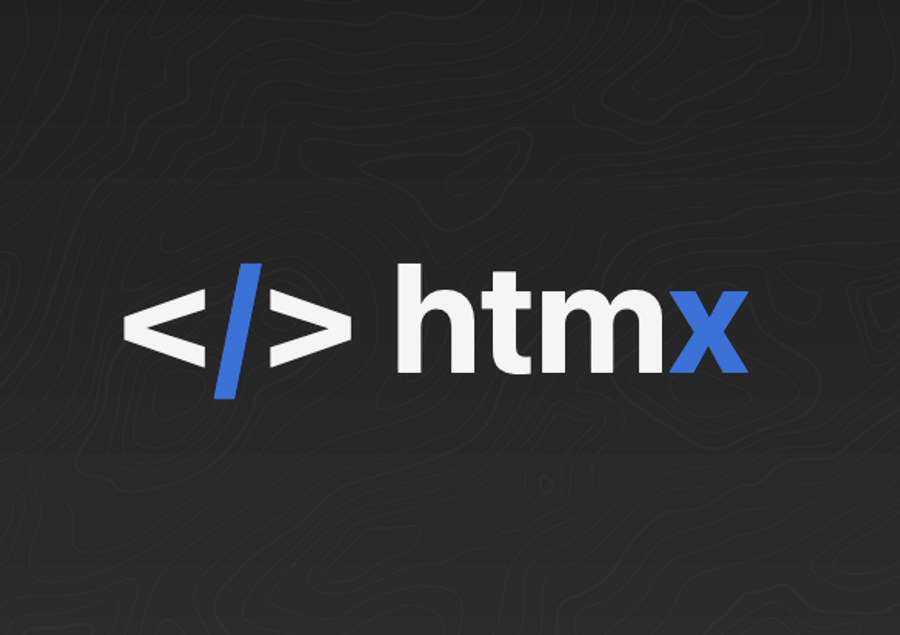
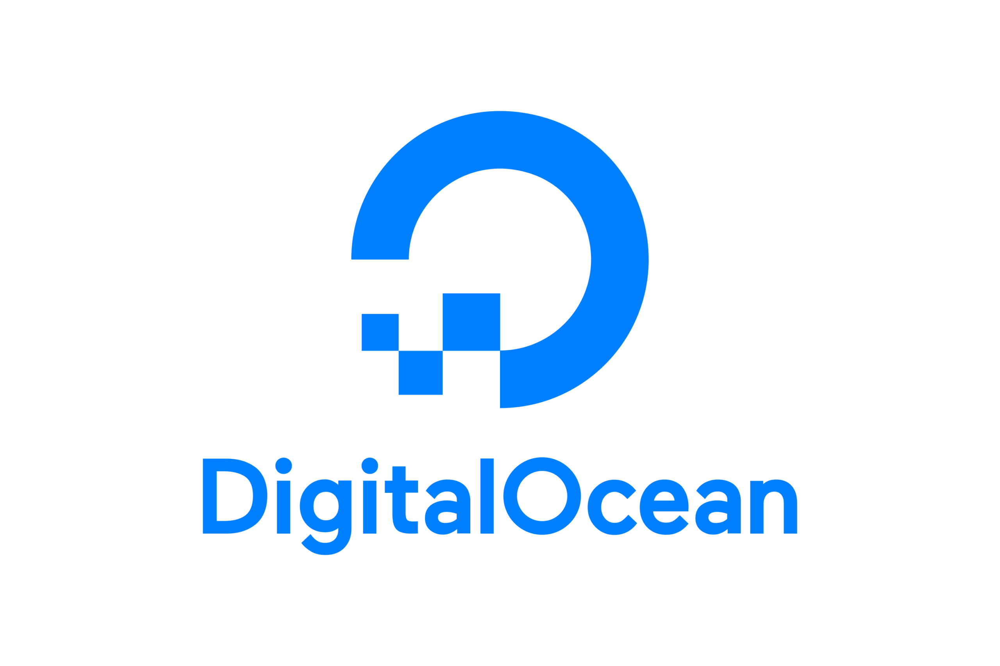
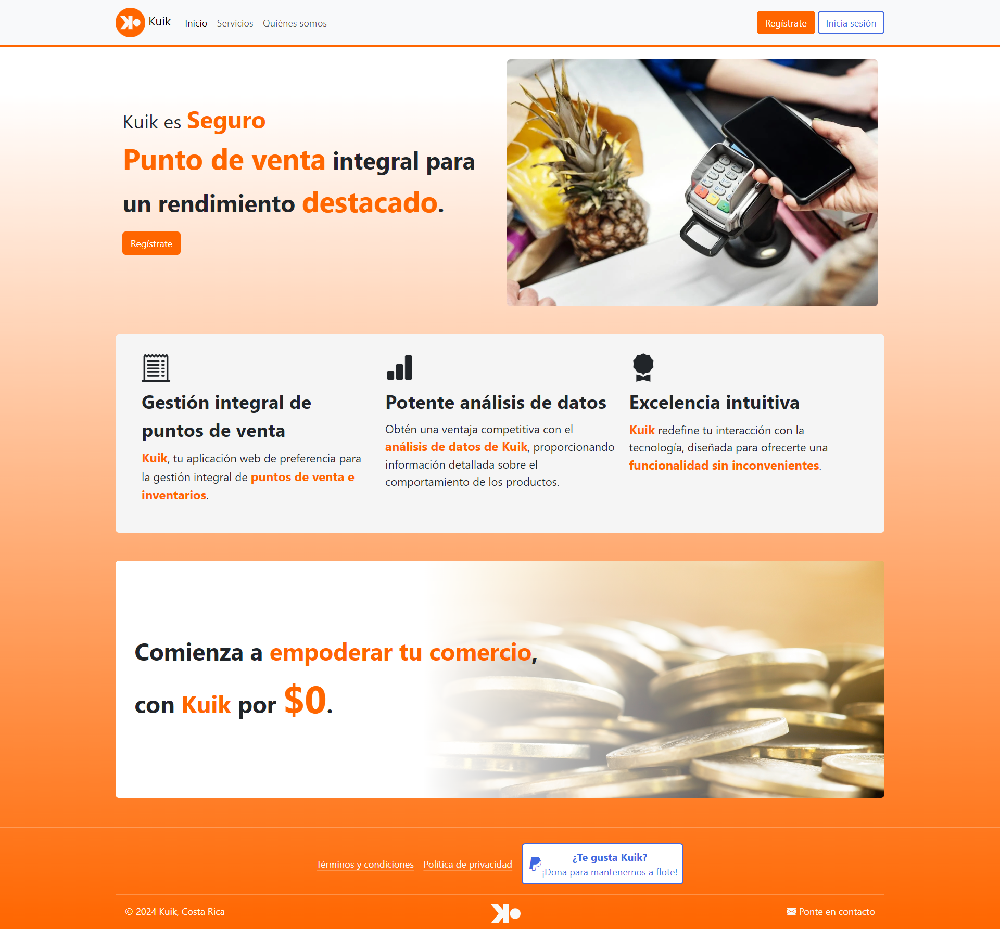
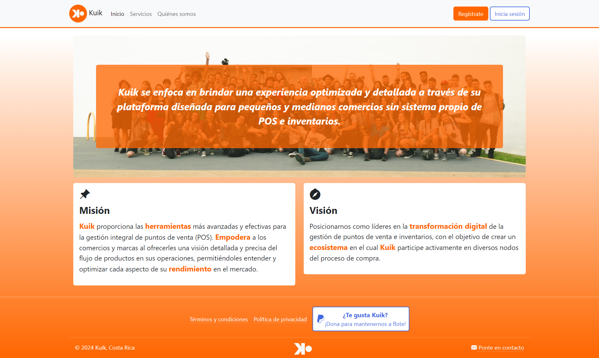
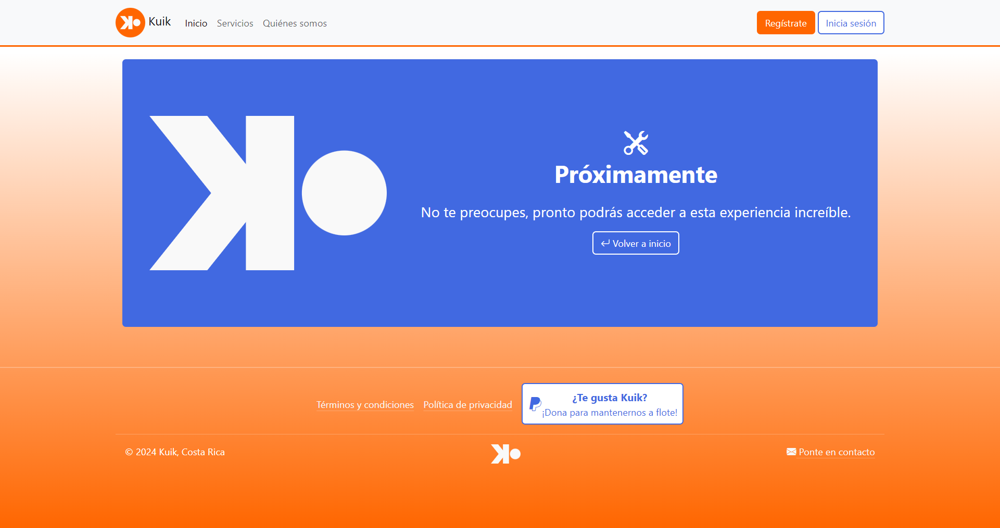
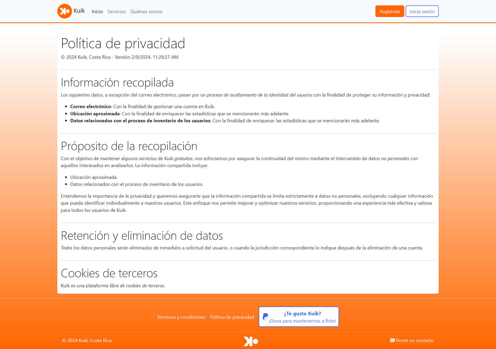
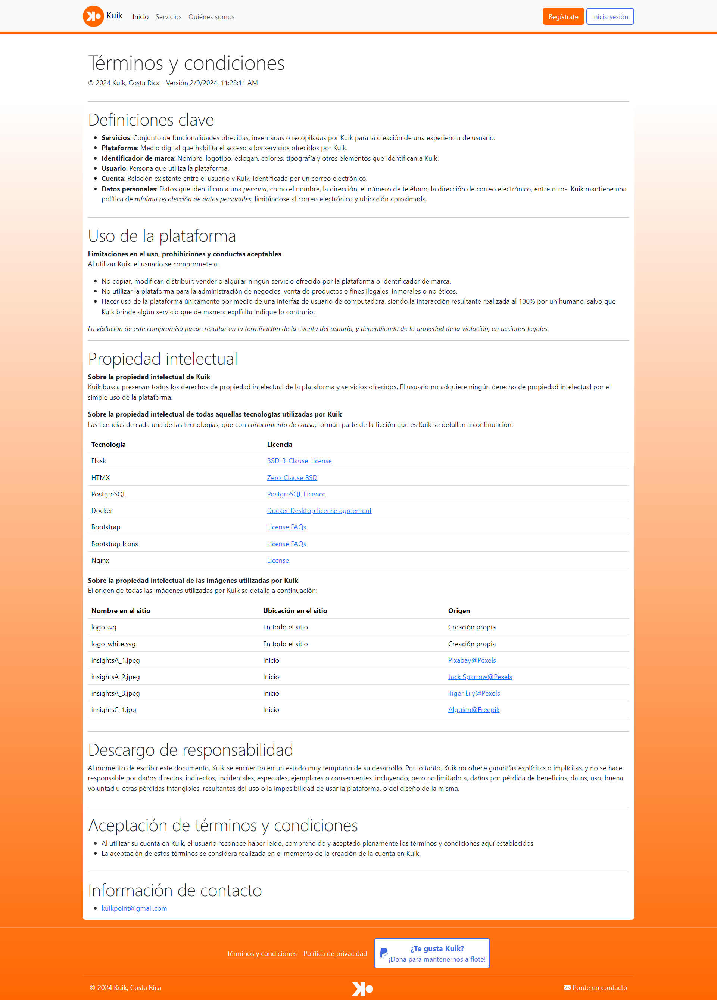

# Index

- [What is it?](#what-is-it)
  - [Branding](#branding)
  - [Mission](#mission)
  - [Vision](#vision)
  - [Project type](#project-type)
- [About me](#about-me)
  - [My role in the project](#my-role-in-the-project)
- [Development status](#development-status)
- [Powered by](#powered-by)
- [Gallery](#gallery)

# What is it?

**Kuik** is a web application specialized in the **comprehensive management of point of sale (POS) systems**, as well as in **efficient inventory administration**. The platform stands out for its ability to conduct internal data analysis, providing businesses with a detailed and accurate insight into product sales.

Moreover, **Kuik** goes further by offering **external data analytics**, aimed at brands interested in understanding the performance of their products in any store offering them. External data mining allows brands to obtain valuable information on how their products (**and those of their competitors**) behave in the market and which establishments stand out.

**Kuik** is the comprehensive solution in the field of point of sale, being an indispensable tool for businesses and brands seeking to optimize their operations and improve their performance in the market.

## Branding

### Logo

### Brand colors

| Name             | Sample                                                      | Hex       |
| ---------------- | ----------------------------------------------------------- | --------- |
| Orange           |  | `#FF6C00` |
| Atomic tangerine |  | `#FF9F5E` |
| Royal blue       |  | `#4169E1` |
| Blue view        |  | `#7D98EA` |
| Cultured         |  | `#F4F4F4` |
| White            |  | `#FFFFFF` |

## Mission

**Kuik** provides the most advanced and effective **tools** for comprehensive point-of-sale (POS) management. It **empowers** businesses and brands by offering them a detailed and precise view of the product flow in their operations, enabling them to understand and optimize every aspect of their **performance** in the market.

## Vision

To position ourselves as leaders in the **digital transformation** of point-of-sale and inventory management, with the aim of creating an **ecosystem** in which **Kuik** actively participates in various nodes of the purchasing process.

## Project type

**Kuik** aims to evolve from a web application to a point-of-sale management and data analysis platform, with the goal of becoming an ecosystem that encompasses all nodes of the purchasing process, **achieved through the formal establishment of Kuik as a company**. Therefore, Kuik (in other words, [myself](www.linkedin.com/in/isaac-palma-medina-9301a1264)) **seeks to preserve all intellectual property rights of the platform and services offered**.

# About me

> Information Systems Engineering student with a strong passion for programming. My goal is to become a highly skilled Back End developer. Additionally, I have a keen interest in teaching and knowledge sharing.

## My role in the project

I am currently the sole participant, developer, and representative of the project; however, I would love to invite other individuals to join me. As the driving force behind the platform's development, I am responsible for overseeing the entire process, from designing the architecture to implementing features. Additionally, I take charge of the user interface and user experience design, as well as manage the branding and marketing efforts.

# Development status

**Kuik** is currently in its **early stages of development**, therefore it is not yet available for public use.

# Powered by

| Name         | Logo                                               |
| ------------ | -------------------------------------------------- |
| Flask        |         |
| HTMX         |          |
| PostgreSQL   |    |
| Docker       |        |
| Bootstrap    |     |
| Nginx        |         |
| Gitlab       |        |
| DigitalOcean |  |

# Gallery

    

 

    

 

    

 

    

 

    

